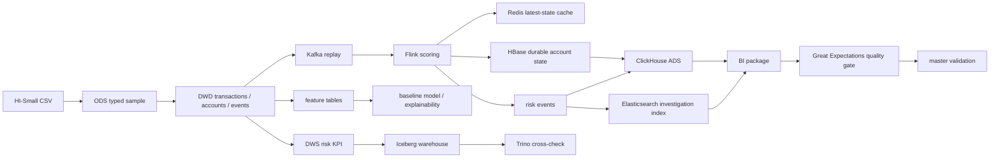

# 金融大数据 AML 风控数据平台

Language: [中文](README.md) | [English](README_en.md)

本仓库展示一个围绕 AML 交易数据构建的大数据风控平台。项目从本地 CSV 数据出发，覆盖离线数仓、湖仓发布、实时风控、账户风险状态、查询检索、BI 展示、质量门禁、治理监控和轻量交付包装。

## 项目范围

| 模块 | 说明 |
| --- | --- |
| 数据来源 | IBM Transactions for Anti Money Laundering 数据族中的 HI-Small 文件 |
| 离线链路 | CSV -> ODS -> DWD -> DWS risk KPI |
| 湖仓链路 | Spark、Hive Metastore、Iceberg |
| 实时链路 | Kafka replay、Flink 规则评分、Redis cache、HBase durable state |
| 查询检索 | Trino、ClickHouse、Elasticsearch |
| BI 展示 | ClickHouse-backed 静态展示包和指标说明 |
| AI 实验 | EDA、特征工程、baseline model、解释性和异常检测 |
| 质量治理 | Great Expectations 质量门禁、Ranger/Atlas 最小治理口径 |
| 运维恢复 | 低内存模块化启动、服务恢复检查、最终验收矩阵 |

当前公开仓库只保留源码、脚本、配置模板和展示文档。运行后生成的数据、证据包、运行日志和本地敏感配置不进入仓库。

## 数据准备

默认数据目录为仓库根目录下的 `datas/`：

```text
datas/HI-Small_Trans.csv
datas/HI-Small_accounts.csv
datas/HI-Small_Patterns.txt
```

当前主链路以 `HI-Small` 为准。`Medium` 可作为后续扩容数据，`Large` 不进入默认验收流程。重新复现时需要自行准备同名数据文件，并遵守原始数据集的许可和引用要求。

## 架构概览



V2 的核心调整：

- Redis 只保留 latest-state cache 职责。
- HBase 保存可恢复、可回查的账户风险状态。
- ClickHouse 作为 V2 OLAP/BI 展示层。
- Elasticsearch 作为 V2 风险事件调查检索层。
- Great Expectations 作为 V2 数据质量门禁。
- Ranger、Atlas、Prometheus、Grafana 只纳入最小治理和监控验收范围。

## 快速开始

只查看代码和文档时无需启动集群：

```powershell
cd <repo-root>
```

本地轻量 smoke：

```powershell
powershell -ExecutionPolicy Bypass -File .\bin\p0_p2_local_smoke.ps1
```

本地 DWD/DWS 构建：

```powershell
powershell -ExecutionPolicy Bypass -File .\bin\p3_p4_local_build.ps1
```

V2 低内存模块化恢复检查：

```powershell
powershell -ExecutionPolicy Bypass -File .\bin\p15v2_local_low_memory_readiness.ps1
```

V2 数据质量门禁：

```powershell
powershell -ExecutionPolicy Bypass -File .\bin\p17v2_local_gx_quality_check.ps1
```

V2 独立总验收：

```powershell
powershell -ExecutionPolicy Bypass -File .\bin\p14v2_master_validation.ps1
```

## 阶段说明

| 阶段 | 目标 | 主要入口 |
| --- | --- | --- |
| P0-P2 | 原始文件预检、画像和 ODS 样本 | `bin/p0_p2_local_smoke.ps1` |
| P3-P4 | DWD 明细层和 DWS 风险指标层 | `bin/p3_p4_local_build.ps1` |
| P5 | 发布 Iceberg 湖仓表 | `bin/p5_cluster_publish.sh` |
| P6 | Kafka/Flink/Redis 实时风控小闭环 | `bin/p6_cluster_realtime_demo.sh` |
| P9-P10 | 特征工程、baseline model、特征一致性 | `bin/p9_local_model_baseline.ps1`、`bin/p10_local_feature_parity.ps1` |
| P11 | 实时评分契约 | `bin/p11_local_realtime_scoring_contract.ps1` |
| P12-P13 | 查询层验证和 BI 材料包 | `bin/p12_local_query_layer_validation.ps1`、`bin/p13_build_bi_dashboard_package.ps1` |
| P14-P18 | 总验收、恢复检查、质量检查和交付包装 | `bin/p14_finance_master_validation.ps1`、`bin/p18_build_portfolio_final_package.ps1` |
| P11v2 | Redis cache + HBase durable state | `bin/p11v2_local_realtime_state.ps1` |
| P12v2 | ClickHouse + Elasticsearch 查询检索 | `bin/p12v2_local_clickhouse_es_validation.ps1` |
| P15v2 | 低内存模块化恢复 readiness | `bin/p15v2_local_low_memory_readiness.ps1` |
| P17v2 | Great Expectations 数据质量门禁 | `bin/p17v2_local_gx_quality_check.ps1` |
| P14v2-P18v2 | V2 总验收和展示包 | `bin/p14v2_master_validation.ps1`、`bin/p18v2_build_portfolio_final_package.ps1` |

## 仓库结构

| 路径 | 说明 |
| --- | --- |
| `src/` | P0-P4 本地离线数仓处理 |
| `streaming/` | P6/P11/P11v2 实时链路样本、Flink SQL 和状态写入 |
| `analysis/` | EDA、特征工程、baseline model、解释性和异常检测 |
| `bin/` | 本地编排、集群脚本、安装检查和验收入口 |
| `config/` | 本地和集群配置模板 |
| `Optimize/` | 优化总结和问题排查摘要 |
| `README.md` / `README_en.md` | 项目展示入口 |
| `项目文档索引_zh.md` | 展示文档索引和阶段状态总览 |
| `项目接口文档_zh.md` | 环境、数据、脚本、表和验收接口 |
| `金融大数据v2版本方案_zh.md` | V2 架构方向和阶段边界 |
| `金融大数据额外配置_zh.md` | V2 组件、版本、端口和部署口径 |
| `模块化启动示例_zh.md` | 低内存模块化启动和释放顺序 |
| `通用大数据流程配置_zh.md` | 通用大数据平台配置摘要 |

## 配置与输出

| 路径 | 说明 |
| --- | --- |
| `config/finance_bigdata.local.yaml` | 本地默认路径、数据集和处理参数 |
| `config/finance_bigdata.cluster.yaml` | 集群路径、命名空间和发布参数 |
| `data/finance_bigdata/` | V1 运行后生成的输出目录 |
| `data/finance_bigdata_v2/` | V2 运行后生成的输出目录 |
| `datas/` | 本地原始数据目录，需自行准备 |

公开仓库不保存本地凭据、原始大文件、Parquet 明细、大型 bulk 文件或运行时日志。需要连接集群的脚本应从本地私有配置读取敏感值，且不应把敏感值写入普通文档或展示包。

## V2 验收摘要

| 能力 | 当前口径 |
| --- | --- |
| 实时状态 | P11v2 使用 Redis cache + HBase durable state |
| 查询展示 | P12v2 使用 ClickHouse ADS 和 Elasticsearch 检索 |
| BI 包 | P13v2 读取已导出的轻量证据，不重新连接集群 |
| 恢复检查 | P15v2 采用 `low_memory_sequential` 模块化恢复 |
| 质量门禁 | P17v2 使用 Great Expectations 读取 V2 accepted evidence |
| 总验收 | P14v2 只读取 V2 证据矩阵，不重跑业务链路 |
| 展示包 | P18v2 只复制小型 Markdown、TSV、JSON、HTML 材料 |

## 展示边界

- 本项目是可复现的大数据风控作品集，不声明为生产银行 AML 系统。
- P9/P16 是机器学习实验和解释性分析，不作为生产级实时模型。
- V1 和 V2 保持独立输出目录；V2 不覆盖 V1 结果。
- Doris 只保留为 V1 查询层历史组件；V2 主展示层是 ClickHouse。
- OpenSearch、Deequ、Soda 是备用组件，不进入 V2 主验收链路。
- 所有公开文档只保留架构、接口、脚本入口、运行边界和可展示结果。

