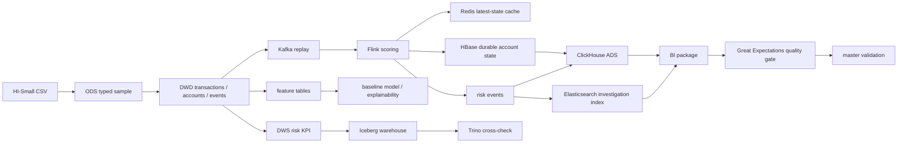

# Finance AML Big Data Risk Platform

Language: [中文](README.md) | [English](README_en.md)

This repository presents a big-data AML risk platform built around transaction data. It starts from local CSV files and covers offline warehouse processing, lakehouse publication, real-time risk scoring, account-risk state storage, query and investigation search, BI materials, data-quality gates, governance/monitoring boundaries, and lightweight delivery packaging.

## Project Scope

| Module | Description |
| --- | --- |
| Data source | HI-Small files from the IBM Transactions for Anti Money Laundering data family |
| Offline pipeline | CSV -> ODS -> DWD -> DWS risk KPI |
| Lakehouse | Spark, Hive Metastore, Iceberg |
| Real-time flow | Kafka replay, Flink rule scoring, Redis cache, HBase durable state |
| Query and search | Trino, ClickHouse, Elasticsearch |
| BI materials | ClickHouse-backed static dashboard package and metric catalog |
| AI experiments | EDA, feature engineering, baseline model, explainability, anomaly detection |
| Quality and governance | Great Expectations quality gate, minimal Ranger/Atlas validation boundary |
| Operations | Low-memory modular startup, recovery checks, master validation matrix |

The public repository keeps source code, scripts, configuration templates, and display-ready documentation. Generated data, evidence packages, runtime logs, and local sensitive configuration stay outside the repository.

## Data Preparation

The default data directory is `datas/` under the repository root:

```text
datas/HI-Small_Trans.csv
datas/HI-Small_accounts.csv
datas/HI-Small_Patterns.txt
```

Dataset source: this project uses the public synthetic AML transaction dataset [IBM Transactions for Anti Money Laundering (AML)](https://www.kaggle.com/datasets/ealtman2019/ibm-transactions-for-anti-money-laundering-aml), associated with the paper [Realistic Synthetic Financial Transactions for Anti-Money Laundering Models](https://arxiv.org/abs/2306.16424). The public GitHub repository does not include the raw CSV dataset. To reproduce the pipeline, download the `HI-Small` files from the dataset page, place them under `datas/`, and follow the original dataset license, citation, and usage terms. This repository keeps only processing code, configuration templates, and display-ready documentation.

The default validation scope is `HI-Small`. `Medium` can be used for later scale-up work. `Large` is outside the default validation flow. To reproduce the project, prepare the same files locally and follow the original dataset license and citation requirements.

## Architecture



Key V2 changes:

- Redis is limited to latest-state cache.
- HBase stores recoverable account-risk state.
- ClickHouse is the V2 OLAP/BI display layer.
- Elasticsearch is the V2 investigation-search layer.
- Great Expectations is the V2 data-quality gate.
- Ranger, Atlas, Prometheus, and Grafana are included only through minimal governance and monitoring validation boundaries.

## Quick Start

Inspecting code and documentation does not require a cluster:

```powershell
cd <repo-root>
```

Local lightweight smoke:

```powershell
powershell -ExecutionPolicy Bypass -File .\bin\p0_p2_local_smoke.ps1
```

Local DWD/DWS build:

```powershell
powershell -ExecutionPolicy Bypass -File .\bin\p3_p4_local_build.ps1
```

V2 low-memory modular readiness:

```powershell
powershell -ExecutionPolicy Bypass -File .\bin\p15v2_local_low_memory_readiness.ps1
```

V2 data-quality gate:

```powershell
powershell -ExecutionPolicy Bypass -File .\bin\p17v2_local_gx_quality_check.ps1
```

V2 master validation:

```powershell
powershell -ExecutionPolicy Bypass -File .\bin\p14v2_master_validation.ps1
```

## Phase Map

| Phase | Goal | Main Entry |
| --- | --- | --- |
| P0-P2 | Raw-file preflight, profiling, ODS sample | `bin/p0_p2_local_smoke.ps1` |
| P3-P4 | DWD detail layer and DWS risk KPI layer | `bin/p3_p4_local_build.ps1` |
| P5 | Publish Iceberg lakehouse tables | `bin/p5_cluster_publish.sh` |
| P6 | Kafka/Flink/Redis real-time risk loop | `bin/p6_cluster_realtime_demo.sh` |
| P9-P10 | Feature engineering, baseline model, feature parity | `bin/p9_local_model_baseline.ps1`, `bin/p10_local_feature_parity.ps1` |
| P11 | Real-time scoring contract | `bin/p11_local_realtime_scoring_contract.ps1` |
| P12-P13 | Query validation and BI package | `bin/p12_local_query_layer_validation.ps1`, `bin/p13_build_bi_dashboard_package.ps1` |
| P14-P18 | Master validation, recovery, quality, delivery package | `bin/p14_finance_master_validation.ps1`, `bin/p18_build_portfolio_final_package.ps1` |
| P11v2 | Redis cache + HBase durable state | `bin/p11v2_local_realtime_state.ps1` |
| P12v2 | ClickHouse + Elasticsearch validation | `bin/p12v2_local_clickhouse_es_validation.ps1` |
| P15v2 | Low-memory modular readiness | `bin/p15v2_local_low_memory_readiness.ps1` |
| P17v2 | Great Expectations data-quality gate | `bin/p17v2_local_gx_quality_check.ps1` |
| P14v2-P18v2 | V2 master validation and display package | `bin/p14v2_master_validation.ps1`, `bin/p18v2_build_portfolio_final_package.ps1` |

## Repository Layout

| Path | Description |
| --- | --- |
| `src/` | P0-P4 local offline warehouse processing |
| `streaming/` | P6/P11/P11v2 real-time samples, Flink SQL, and state writers |
| `analysis/` | EDA, feature engineering, baseline model, explainability, anomaly detection |
| `bin/` | Local orchestration, cluster scripts, install checks, validation entries |
| `config/` | Local and cluster configuration templates |
| `Optimize/` | Optimization and troubleshooting summaries |
| `README.md` / `README_en.md` | Project display entry points |
| `Project-Documentation-Index_en.md` | Display documentation index and phase overview |
| `Project-Interface-Documentation_en.md` | Environment, data, script, table, and validation interfaces |
| `Finance-Big-Data-V2-Plan_en.md` | V2 architecture and phase boundaries |
| `Finance-Big-Data-Additional-Configuration_en.md` | V2 components, versions, ports, and deployment profile |
| `Modular-Startup-Example_en.md` | Low-memory modular startup and release sequence |
| `General-Big-Data-Process-Configuration_en.md` | Common big-data platform configuration summary |

## Configuration And Outputs

| Path | Description |
| --- | --- |
| `config/finance_bigdata.local.yaml` | Local default paths, dataset, and processing parameters |
| `config/finance_bigdata.cluster.yaml` | Cluster paths, namespaces, and publication parameters |
| `data/finance_bigdata/` | Generated V1 output directory |
| `data/finance_bigdata_v2/` | Generated V2 output directory |
| `datas/` | Local raw-data directory, prepared outside the repository |

The public repository does not store local credentials, raw large files, Parquet detail files, large bulk files, or runtime logs. Cluster scripts should read sensitive values from private local configuration and must not write them into public documentation or display packages.

## V2 Validation Summary

| Capability | Current Boundary |
| --- | --- |
| Real-time state | P11v2 uses Redis cache + HBase durable state |
| Query display | P12v2 uses ClickHouse ADS and Elasticsearch search |
| BI package | P13v2 reads exported lightweight evidence without reconnecting to the cluster |
| Recovery check | P15v2 uses `low_memory_sequential` modular recovery |
| Quality gate | P17v2 uses Great Expectations over V2 accepted evidence |
| Master validation | P14v2 reads the V2 evidence matrix without rerunning business pipelines |
| Display package | P18v2 copies only small Markdown, TSV, JSON, and HTML materials |

## Public Boundary

- This is a reproducible big-data AML portfolio project, not a production banking AML system.
- P9/P16 are machine-learning experiments and explainability analysis, not production real-time models.
- V1 and V2 keep separate output directories; V2 does not overwrite V1 results.
- Doris remains a historical V1 query-layer component; ClickHouse is the V2 display layer.
- OpenSearch, Deequ, and Soda are backup components and are not part of the V2 main validation chain.
- Public documentation keeps only architecture, interfaces, script entries, operating boundaries, and display-ready results.

