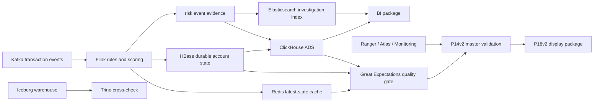

# 金融大数据 V2 版本方案

Language: [中文](金融大数据v2版本方案_zh.md) | [English](Finance-Big-Data-V2-Plan_en.md)

最近更新：2026-07-03

本文件定义金融大数据平台的 V2 架构方向、阶段职责、验收边界和后续扩展策略。它是公开展示版方案文档，不记录临时工作记录、本地环境路径、长篇安装日志或敏感配置值。

## 1. V2 定位

V1 已完成端到端跑通：本地离线数仓、湖仓发布、实时风控、查询层、BI 材料、AI 实验、质量检查和轻量交付包装。

V2 的目标不是推翻 V1，而是在独立输出目录中把项目升级为更贴近金融交易风控的版本：

```text
交易流 -> 风险评分 -> 账户状态 -> 查询检索 -> BI 展示 -> 质量门禁 -> 治理监控 -> 独立总验收
```

V2 核心原则：

- V1 证据保留，V2 独立生成。
- Redis 从事实状态源降级为 cache。
- HBase 保存可恢复的账户风险状态。
- ClickHouse 作为 V2 OLAP/BI 展示层。
- Elasticsearch 作为 V2 风险事件调查检索层。
- Great Expectations 作为 V2 数据质量门禁。
- Ranger、Atlas、Prometheus、Grafana 只做最小治理和监控验收。
- 所有展示包只复制小型可读证据，不包含本地敏感配置或大型明细数据。

## 2. V2 主链路



## 3. 阶段设计

| 阶段 | 目标 | 主入口 | 主输出 |
| --- | --- | --- | --- |
| P11v2 | 实时状态落地 | `bin/p11v2_local_realtime_state.ps1` | Redis cache、HBase durable state、风险事件证据 |
| P12v2 | 查询与调查检索验证 | `bin/p12v2_local_clickhouse_es_validation.ps1` | ClickHouse 查询结果、Elasticsearch 检索样例 |
| P13v2 | BI 展示材料包 | 静态包生成脚本 | 指标目录、页面设计、预览 HTML |
| P15v2 | 模块化恢复 readiness | `bin/p15v2_local_low_memory_readiness.ps1` | 服务状态、内存快照、释放记录 |
| P17v2 | 数据质量门禁 | `bin/p17v2_local_gx_quality_check.ps1` | GX 结果、质量规则、检查明细 |
| P14v2 | 独立总验收 | `bin/p14v2_master_validation.ps1` | V2 验收矩阵、组件验收表、边界扫描 |
| P18v2 | 轻量展示包 | `bin/p18v2_build_portfolio_final_package.ps1` | 展示入口、证据清单、包边界扫描 |

推荐依赖顺序：

```text
P11v2 -> P12v2 -> P13v2 -> P15v2 -> P17v2 -> P14v2 -> P18v2
```

## 4. P11v2 实时状态落地

目标：把 V1 中偏 cache 的实时结果升级为可恢复、可回查的账户风险状态。

输入：

- P9/P10 形成的非泄漏特征口径。
- P11v2 风险事件样本。
- Kafka/Flink/Redis/HBase 最小实时依赖。

输出：

- `risk_events_raw.jsonl`
- `p11v2_state_summary.tsv`
- `hbase_readback_sample.tsv`
- Redis/HBase 一致性检查结果

验收边界：

- Redis 只做 latest-state cache。
- HBase 保存 durable account risk state。
- Flink 规则评分是可解释评分，不声明为生产模型概率。
- P11v2 不要求 ClickHouse、Elasticsearch 或 BI 包作为主验收条件。

## 5. P12v2 查询与调查检索

目标：把 V2 查询展示层从 V1 的 Doris 历史 smoke 迁移到 ClickHouse + Elasticsearch。

组件职责：

| 组件 | 职责 |
| --- | --- |
| Trino | Iceberg 事实表交叉查询 |
| ClickHouse | ADS/BI 展示查询 |
| Elasticsearch | 风险事件调查检索 |
| OpenSearch | 备用组件，不进入主验收 |

输出：

- `clickhouse_query_results.tsv`
- `clickhouse_query_status.tsv`
- `elasticsearch_index_status.tsv`
- `elasticsearch_search_sample.json`
- `postcheck.tsv`

验收边界：

- ClickHouse 是展示层，不是事实源。
- Elasticsearch 是检索副本，不是事实源。
- Doris 不进入 V2 主验收。
- OpenSearch 不能替代 Elasticsearch 作为 V2 主证据。

## 6. P13v2 BI 展示包

目标：把 P12v2 已导出的轻量查询和检索结果组织成可读、可展示、可携带的 BI 材料包。

产物：

- `dashboard_index.md`
- `dashboard_preview.html`
- `dashboard_metric_catalog.md`
- `dashboard_page_design.md`
- `dashboard_sql_reference.md`
- `package_boundary_scan.tsv`

边界：

- 不重新连接集群。
- 不重跑 P11v2/P12v2。
- 不生成总验收结论。
- 只复制小型 Markdown、TSV、JSON、HTML 材料。
- 不复制原始数据、大型明细、bulk 响应或本地敏感配置。

## 7. P15v2 模块化恢复 readiness

目标：证明 V2 组件可以在低内存集群中按需启动、检查和释放，而不是长期全部常驻。

执行模式：`low_memory_sequential`

检查模块：

| 模块 | 检查点 |
| --- | --- |
| base platform | HDFS、YARN、PostgreSQL、Hive Metastore、Iceberg |
| realtime module | Kafka、Redis、Flink、ZooKeeper、HBase |
| query/search module | Trino、ClickHouse、Elasticsearch |
| governance module | Ranger、Atlas 最小 readiness |
| monitoring module | Prometheus、Grafana 轻量可访问性 |
| backup components | OpenSearch、Deequ、Soda 状态记录 |

边界：

- 不重建业务数据。
- 不重跑 P11v2/P12v2。
- 不重建 P13v2 BI 包。
- 不要求所有 V2 组件同时常驻。
- 验证重组件后应释放，降低 hadoop1 内存压力。

## 8. P17v2 数据质量门禁

目标：用 Great Expectations 读取 V2 accepted evidence，形成可重复运行的数据质量门禁。

输入：

- P11v2 状态证据。
- P12v2 查询和检索证据。
- P13v2 BI 包状态。
- P15v2 模块化恢复状态。

输出：

- `quality_check_results.tsv`
- `quality_rule_catalog.md`
- `gx_validation_result.json`
- `gx_checkpoint_summary.tsv`
- `source_evidence_manifest.tsv`

边界：

- 只读取已有证据。
- 不启动全量集群。
- 不重新写 HBase、ClickHouse 或 Elasticsearch。
- 不替代 P14v2 独立总验收。

## 9. P14v2 独立总验收

目标：把 P11v2、P12v2、P13v2、P15v2、P17v2 的证据统一到 V2 验收矩阵中。

输出：

- `summary.tsv`
- `phase_evidence_status.tsv`
- `v2_validation_matrix.tsv`
- `component_validation.tsv`
- `key_metric_validation.tsv`
- `boundary_scan.tsv`

验收条件：

- 阶段证据齐全。
- HBase、ClickHouse、Elasticsearch、GX、治理、监控和模块化恢复均有对应检查结果。
- 边界扫描无失败项。
- 不读取 V1 结果冒充 V2 结果。
- 不启动集群或重跑业务链路。

## 10. P18v2 展示包

目标：在 P14v2 通过后，生成轻量、可携带、可展示的 V2 包。

输出：

- `portfolio_index.md`
- `accepted_evidence_manifest.tsv`
- `copied_materials_manifest.tsv`
- `package_boundary_scan.tsv`
- `p18v2_summary.md`

边界：

- 不做新的计算。
- 不做新的总验收。
- 不处理原始数据。
- 不复制大型明细或本地敏感配置。
- 不覆盖 V1 展示包。

## 11. 可复用资产

V2 可以复用 V1 的以下资产：

- P0-P4 本地数据处理链路。
- P5 Iceberg 发布方式。
- P9/P10 非泄漏特征工程和一致性校验。
- Kafka/Flink SQL 模板和实时评分字段设计。
- `cluster_ssh.py` 远程执行框架。
- P12 查询验证思路。
- P13 轻量 BI 包生成方式。
- P14/P18 的轻量验收和包装边界。

复用的是处理能力、执行框架和验收方法，不是复用 V1 结论来替代 V2 结果。

## 12. 暂不进入 V2 主线

| 内容 | 原因 |
| --- | --- |
| Doris | 保留为 V1 历史组件，V2 展示层使用 ClickHouse |
| OpenSearch | 备用组件，不替代 Elasticsearch |
| Deequ / Soda | 备用质量组件，不替代 Great Expectations |
| Debezium / Kafka Connect | 可作为后续 CDC 增强，当前不是默认主链路 |
| Kibana / OpenSearch Dashboards | 当前展示包以静态 BI 材料为主 |
| 三节点 ClickHouse | 当前资源下先保持单节点验收 |
| 全组件同时启动 | 与低内存模块化运行策略冲突 |

## 13. 当前结论

金融大数据 V2 的方向是：在 V1 已跑通的基础上，围绕交易风险、账户状态、调查检索、质量治理和 BI 查询建立独立的金融优化版证据链。

后续工作应优先保持文档和代码的公开可展示质量，并把可选增强作为独立阶段验收，而不是重跑或改写已经通过的 V2 主链路。

